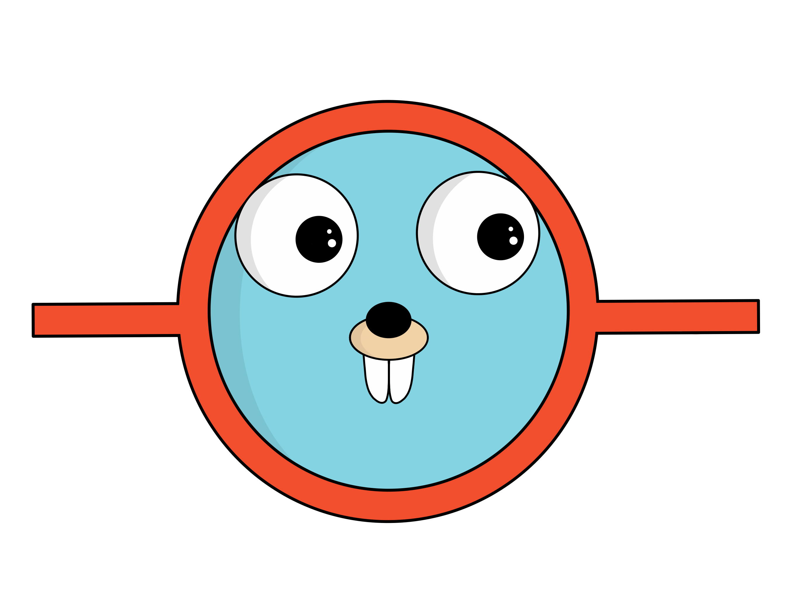
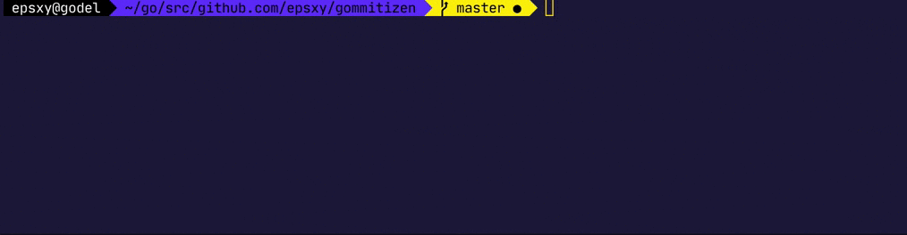

# gommitizen





A simple cross platform git commit CLI. Inspired from [commitizen](https://github.com/commitizen/cz-cli) and using the amazing [promptui](https://github.com/manifoldco/promptui) library.

This tool aims to quickly creates commits that follow the [conventional commits](https://www.conventionalcommits.org) spec. It currently supports just a simple part of the spec: generating commit messages of the form:

`<type>([optional scope])[optional !]: <commit message>`

Where,

- `type`: one element from `feat`, `fix`, `build`, `chore`, `ci`, `docs`, `style`, `refactor`, `perf`, `test`.
- `scope`: indicates where the modification took place (component affected for example). Totally optional. Can be `client`, `server`, etc.
- `!`: indicates wether the commit introduces a breaking change (if present) or not. It's optional.
- `commit message`: a single line of max 72 chars indicate the nature of the change.

Examples:

```
feat(client): add login page
feat(client)!: migrate all webservices to v2 api
ci: add an e2e tests step
```

# Todo

- [x] Create commit messages with default params
- [x] Add .env file to customize params
- [ ] Support more custom params (commit length, etc)
- [ ] Add tests
- [x] Release v1.0
- [ ] Add cross platform builds to releases
- [x] Add installation and usage documentation
- [ ] BUG(promptui): MacOS ring bell triggers in multi select prompt
- [ ] Propose to `git add -A` if running gommitizen without any file added
- [ ] Generate Changelog
- [ ] Commit validation (prehook)

# Quickstart

```bash
# build
make build

# run
make run
```

# Installation

## From source

You need Go installed on your computer.

- Make your your `$GOPATH` and `$PATH` env variables are set up. You can type the following command in your terminal, or add them in your bash configuration file (`.bashrc`, `.zshrc`, etc) if you want this configuration to persist after you close your terminal:
```bash
export GOPATH=$HOME/go
export PATH=$PATH:$GOROOT/bin:$GOPATH/bin
```
- Build and install the project binary. This will add the generated executable in $GOPATH/bin:
```bash
go install
```

- You should be ready to go now, the following command should work in your terminal:
```bash
gommitizen
```

Troubleshooting:
- Verify your environment variables have been correctly set up: `echo $GOPATH`, `echo $PATH`.
- Open and close a new terminal to apply the changes you made to your shell configuration file. Or source it using `source ~/.bashrc`.
- Verify the binary has been correctly generated in your `GOPATH/bin` directory: `ls $GOPATH/bin`.

## From binary

TODO.

# Usage

You have to be in a git repository, otherwise gommitizen will return and error and close itself. You have to git add the files **before** launching gommitizen. Type `gommitizen` in a shell at your repository's path and follow the indications to proceed in formatting your commit message.

Gommitizen will basically `git commit -m [message]` with a nicely formatted message you will create using the CLI.

# Configuration file

You can set up your custom commit scopes and types in a configuration file at the route of your repository. Create a `.gommitizen.yml` file matching the following structure:

```yaml
types:
    - first
    - second
    - ...
scopes:
    - first-scope
    - second-scope
    - ...
```

If you want to propose users to use an empty scope, you can add an empty option:

```yaml
scopes:
    - 
    - first
    - second
```

This file can be present, present partially, or absent. If the file or one of its option is missing, the default parameters will apply. This repository contains a `.gommitizen.yml` example file.

# Licence

The MIT Licence