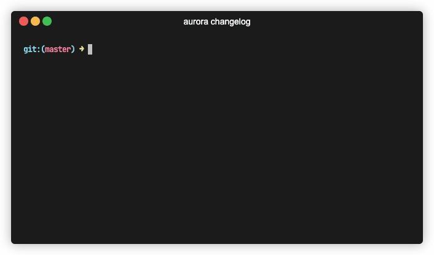

## Command

```bash
aurora changelog $GIT_REV1 $GIT_REV2
```

`$GIT_REV1` is optional and default to `HEAD`.

## Description

Aurora changelog generator allows you to automatically generate markdown formatted changelogs for your releases. It parses (_first parent_) commit messages between 2 git revisions and select, classify and parses them into markdown in a chronological order. It also ignore merge commits (_TODO_, improve merge commit detection).

The suggested usage is to generate changelogs when releasing a new version. And then, you can copy/paste your changelog inside your release.

## Todo

- Add the possibility to configure the generated template
- Perform the actual git tag operation & release operation
- Automatically find the last release, i.e. generating a release between now and the previous release just by typing `aurora changelog generate` for example.

## Example

If your latest released version has been tagged under `v1.2.3` and you want to release `v2.0.0`

```bash
aurora changelog v1.2.3
```

That's all. It will generate the changelog between your current git `HEAD` and until the `v1.2.3` revision. Parsing all the first parent commits in between.