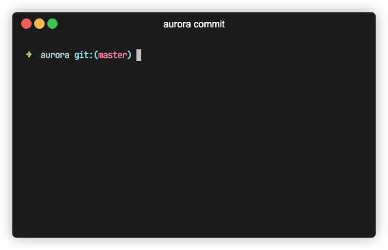

Gommitizen allows you to create commits respecting the conventional commits spec.

## Command

```bash
gommitizen commit
```

## Description

Gommitizen helps you formatting commits matching the following form

```
<TYPE>([OPTIONAL_SCOPE])[OPTIONAL_!]: <COMMIT_MESSAGE>
```

- `type`: the type of commit, can be `feat`,`fix`,`build`,`chore`,`ci`,`docs`,`style`,`refactor`,`perf` or `test`.
- `scope` (**optional**): indicates the component where the commit takes place. For example `client`, `server`.
- `!` (**optional**): indicates wether the commit is a breaking change or not.
- `commit_message`: a short description, between 1 and 72 characters, explaining in details what is the purpose of the commit. NB: In conventional commits, it's indicated it should be below 50 chars. I personally prefer setting the limit to 72 chars.

## Example

Below, an example of valid commits

```
feat(client)!: migrate server routes to v2 api
fix(server): return valid http codes when user auth is rejected
ci: check cucumber tests in pipelines
```