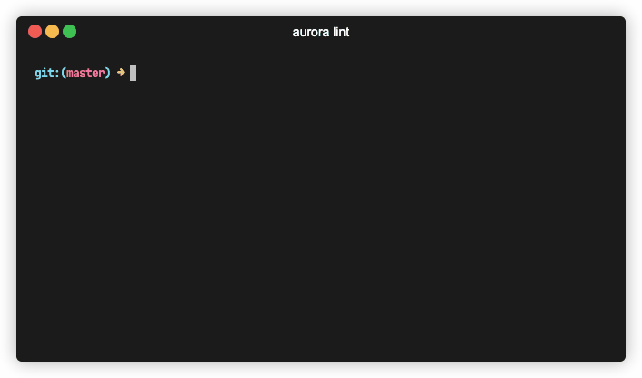

## Command

```bash
gommitizen lint $GIT_REV1 $GITREV2
```

`$GIT_REV1` is optional and default to `HEAD`, meaning that the 2 following commands have the same result


```bash
gommitizen lint master
gommitizen lint HEAD master
```

## Description

Gommitizen linter allows you to lint commits between 2 git revisions. A git revision can be a hash, a tag, etc. A commit is considered valid in the following cases:

- Regex `^(revert: )?(feat|fix|docs|style|refactor|perf|test|chore|ci)(\\(.+\\))?(\\!)?: .{1,72}` is matched. This is one conventionnal commit regex checker.
- Commit is a merge commit (i.e. for now, commit message contains `Merge` string). This has to be improved.

Commit considered for validation are `first-parent` commits. Meaning the linter will not explore the inner branches while running on a particular path. I am considering changing this behavior.

Right now the suggested behavior is to run the linter in features branches besides master, e.g. `gommitizen lint feat-branch master`, in order to validate that commits merged to master will respect your commit convention (you can embed gommitizen in your CI pipelines).

## Todo

New features which will be implemented next are:

- configuration file support (regexes for linting, regexes for ignoring commits, indicating master branch, etc)
- limit commits analysed with a CLI flag (e.g. `gommitizen lint HEAD master --limit 100`)

## Example

See some use cases below

```bash
# Lint commits between HEAD and master
gommitizen lint HEAD master

# Lint commits until v0.1.0 tag
gommitizen lint HEAD v0.1.0

# Lint commits made into feat-my-new-feature branch until it diverges from master
gommitizen lint feat-my-new-feature master

# Lint commits between 2 commits
gommitizen lint eb8a923 700dcec
```