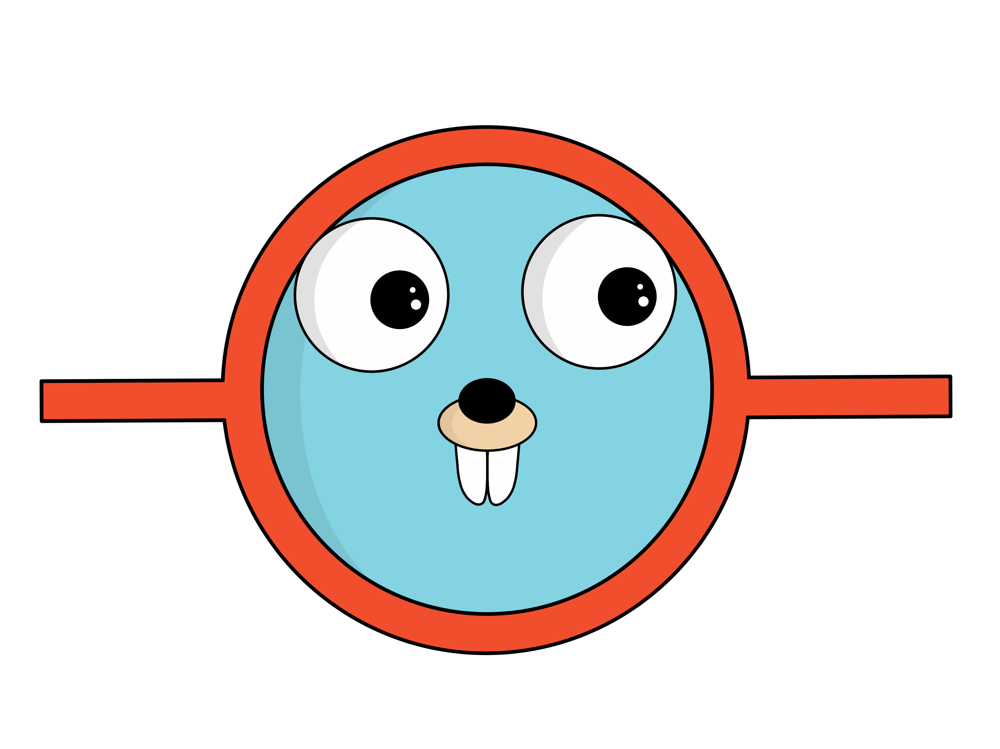

## What's aurora?

Aurora is a lighweight git utility CLI, written in go, which purpose is to facilitate and standardize the git workflow while working on a software. The main purpose is to help you create commits, versions respects the [conventional commits](https://www.conventionalcommits.org/) and [semver](https://www.semver.org) specs. The tool (and its name) is inspired from [**commitizen**](https://github.com/commitizen/cz-cli), a very thorough git utility written in JavaScript.

Why go? Because it's performant, cross-platform, easy to compile and deploy. There is no requirements or dependency besides `git` to use Aurora.

## Requirements

As explained above, you need the following dependencies

- `Git`, because Aurora uses `git` commands under the hood to perform operation on commits. 